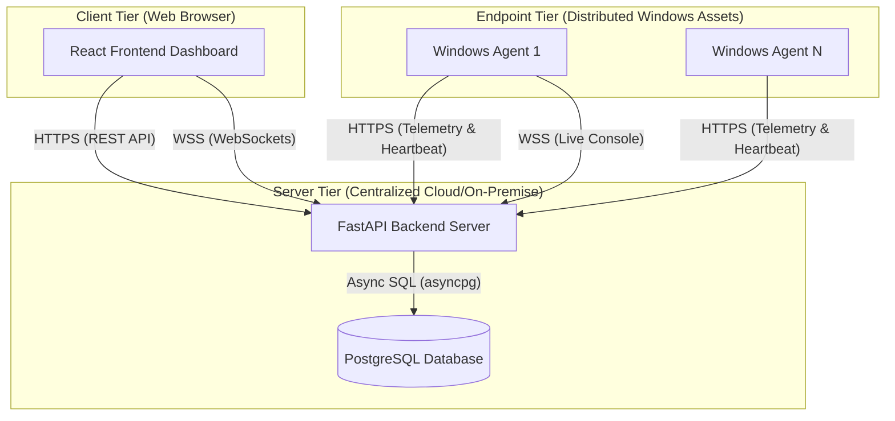

# Chapter 6. System Architecture

## 6.1 Introduction
The architecture of Endpoint Sentinel X is designed around the principles of decoupling, scalability, and asynchronous processing. By separating the system into three distinct tiers—the Windows Agent, the centralized Backend, and the Web Frontend—the platform achieves a highly modular design. This chapter details the overall system architecture and the specific components that make up each tier.

## 6.2 Overall System Architecture
Endpoint Sentinel X employs a modern client-server architecture utilizing RESTful APIs for structured telemetry data and secure WebSockets for real-time bidirectional communication. 

*Figure 6.1: High-Level System Architecture (To be rendered in Draw.io)*

## 6.3 Backend Architecture
The backend is the core nervous system of the platform, built using Python and **FastAPI**. It is designed to handle high concurrency using asynchronous event loops (`asyncio`).

### 6.3.1 Core Components
1.  **API Layer (`app/api`):** Defines the RESTful endpoints used by both the frontend dashboard and the remote agents. It handles request validation using Pydantic models.
2.  **Service Layer (`app/services`):** Contains the business logic. It isolates the API routes from the database layer, allowing for cleaner code and easier unit testing.
3.  **Database Layer (`app/db`):** Utilizes **SQLAlchemy 2.0** with the asynchronous `asyncpg` driver to connect to the PostgreSQL database. **Alembic** is used for schema migrations.
4.  **WebSocket Manager:** A dedicated class responsible for maintaining active WebSocket connections, routing terminal output from the agent directly to the correct frontend dashboard session.

## 6.4 Agent Architecture
The Windows Agent is a highly privileged, standalone executable built using Python and packaged with **PyInstaller**. It operates entirely in the background as a Windows Service under the `LocalSystem` account.

### 6.4.1 Core Components
1.  **Service Manager (`service.py`):** Interfaces with the Windows Service Control Manager (SCM). It handles installation, startup, graceful shutdown, and continuous execution loops.
2.  **Telemetry Collectors (`collectors/`):** A modular set of scripts utilizing `psutil` and Windows Management Instrumentation (WMI) to gather deep system data (hardware, software, services).
3.  **Command Handler (`commands/`):** Periodically polls the backend for pending scripts. Upon receiving a command, it spawns a subprocess (e.g., `powershell.exe`), captures standard output (`stdout`) and standard error (`stderr`), and posts the results back to the server.
4.  **WebSocket Client (`live_console.py`):** Establishes an outbound WSS connection when requested, hooking directly into a persistent `cmd.exe` or `powershell.exe` process via standard I/O pipes.

## 6.5 Frontend Architecture
The frontend is built using **React 18** and **TypeScript**, bundled with **Vite** for rapid development and optimized production builds. It provides a Single Page Application (SPA) experience.

### 6.5.1 Core Components
1.  **State Management:** Utilizes React hooks and Context API for global state (e.g., Authentication state).
2.  **Component Library:** Uses **Tailwind CSS** for rapid, utility-first styling, providing a cohesive dark-mode aesthetic consistent with modern cybersecurity tools.
3.  **Routing:** Manages navigation between the Global Dashboard, Endpoint Details, Remote Commands, and Live Console views.
4.  **XTerm.js Integration:** The Live Console page embeds `xterm.js` to render the remote shell directly within the browser, providing a native terminal feel complete with ANSI color support and keystroke capturing.

## 6.6 Security Architecture
Security is enforced at every layer of the architecture:
1.  **Transport Security:** All REST API and WebSocket traffic is encrypted using TLS 1.2/1.3 (HTTPS/WSS).
2.  **Agent Authentication:** Agents enroll using a time-limited token to receive a persistent JWT. All subsequent telemetry uploads require this JWT in the `Authorization` header.
3.  **Administrator Authentication:** Access to the web dashboard requires strict username/password authentication, generating an admin-scoped JWT.
4.  **Role-Based Access Control (RBAC):** The backend API enforces permissions, ensuring that only users with specific roles (e.g., `SuperAdmin`, `EndpointManager`) can view data or dispatch commands.

## 6.7 Deployment Architecture
While highly flexible, the recommended deployment architecture places the FastAPI backend behind a reverse proxy (such as Nginx or Traefik) which handles SSL termination. The PostgreSQL database resides in an isolated subnet accessible only by the backend server. The Windows agents reside across varying corporate or public networks, initiating outbound connections exclusively to the reverse proxy.
