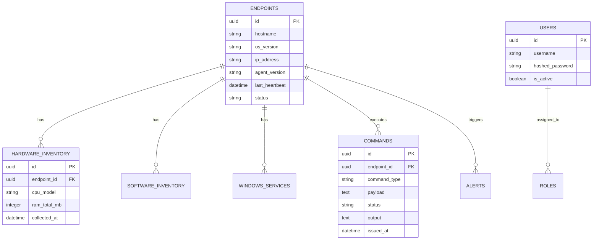

# Chapter 7. Database Design

## 7.1 Introduction
The database is the persistent backbone of Endpoint Sentinel X. Given the requirement for high concurrency—especially when hundreds of agents simultaneously upload telemetry or fetch commands—the system utilizes **PostgreSQL** in conjunction with the asynchronous `asyncpg` driver. This chapter outlines the schema design, entity relationships, and core tables.

## 7.2 Entity-Relationship (ER) Model
The schema is highly relational, with the `endpoints` table serving as the central entity. All telemetry, logs, and command histories maintain foreign key relationships with the `endpoints` table.

*Figure 7.1: Simplified Entity-Relationship Diagram (To be rendered in Draw.io)*

## 7.3 Database Schema and Data Dictionary

### 7.3.1 `endpoints` Table
**Purpose:** Acts as the central registry for all enrolled agents.
*   **id (UUID, PK):** Unique identifier for the endpoint.
*   **hostname (VARCHAR):** The NETBIOS name of the Windows machine.
*   **os_version (VARCHAR):** Specific Windows OS build.
*   **ip_address (VARCHAR):** Last known public or private IP.
*   **agent_version (VARCHAR):** The software version of the installed Sentinel agent.
*   **last_heartbeat (TIMESTAMP):** Automatically updated by the agent's background polling loop to determine online/offline status.

### 7.3.2 `hardware_inventory` Table
**Purpose:** Stores point-in-time hardware specifications.
*   **id (UUID, PK):** Unique record ID.
*   **endpoint_id (UUID, FK):** Links to `endpoints`. Configured with `ON DELETE CASCADE`.
*   **cpu_model (VARCHAR):** CPU branding string.
*   **ram_total_mb (INTEGER):** Total physical memory.
*   **collected_at (TIMESTAMP):** When the inventory was synchronized.

### 7.3.3 `software_inventory` Table
**Purpose:** Maintains a list of installed applications.
*   **id (UUID, PK):** Unique record ID.
*   **endpoint_id (UUID, FK):** Links to `endpoints`.
*   **name (VARCHAR):** Name of the software.
*   **version (VARCHAR):** Installed version.
*   **vendor (VARCHAR):** Software publisher.

### 7.3.4 `commands` Table
**Purpose:** Acts as the asynchronous queue and historical log for remote execution.
*   **id (UUID, PK):** Unique command ID.
*   **endpoint_id (UUID, FK):** Target machine.
*   **command_type (VARCHAR):** e.g., 'POWERSHELL', 'CMD'.
*   **payload (TEXT):** The actual script to be executed.
*   **status (VARCHAR):** Current state (PENDING, SENT, COMPLETED, FAILED).
*   **output (TEXT):** The `stdout` and `stderr` returned by the agent.
*   **issued_at (TIMESTAMP):** When the admin created the command.

### 7.3.5 `windows_service_inventory` Table
**Purpose:** Tracks the running state and startup configuration of Windows services.
*   **id (UUID, PK):** Unique record ID.
*   **endpoint_id (UUID, FK):** Links to `endpoints`.
*   **service_name (VARCHAR):** Internal service name (e.g., `Spooler`).
*   **display_name (VARCHAR):** Human-readable name.
*   **status (VARCHAR):** Current state (Running, Stopped).
*   **start_type (VARCHAR):** Startup configuration (Auto, Manual, Disabled).

### 7.3.6 `alerts` Table
**Purpose:** Logs system anomalies or security events detected by the backend.
*   **id (UUID, PK):** Unique record ID.
*   **endpoint_id (UUID, FK, Nullable):** Target machine. If null, the alert is system-wide.
*   **severity (VARCHAR):** Critical, Warning, Info.
*   **message (TEXT):** Alert description.
*   **created_at (TIMESTAMP):** When the alert was generated.

### 7.3.7 `audit_logs` Table
**Purpose:** Provides a forensic trail of all administrative actions.
*   **id (UUID, PK):** Unique record ID.
*   **endpoint_id (UUID, FK, Nullable):** The machine the action was performed against.
*   **user_id (UUID, FK):** The administrator who performed the action.
*   **action (VARCHAR):** The operation (e.g., `DISPATCH_COMMAND`, `DELETE_ENDPOINT`).
*   **timestamp (TIMESTAMP):** Exact time of execution.

### 7.3.8 `users` and `roles` Tables
**Purpose:** Manages administrator access and Role-Based Access Control.
*   **users:** Stores `username` and securely bcrypt-hashed passwords.
*   **roles:** Defines specific permission scopes (e.g., `SuperAdmin`, `Read-Only`).
*   **user_roles (Join Table):** Maps users to their respective roles.

## 7.4 Cascade and Integrity Rules
To maintain database integrity and ensure clean deletion of assets, all tables referencing `endpoint_id` are strictly configured with `ON DELETE CASCADE`. If an endpoint is manually deleted from the web dashboard, all associated hardware inventory, software lists, command histories, and localized alerts are atomically wiped from the database. This design prevents orphaned records and simplifies data lifecycle management.
