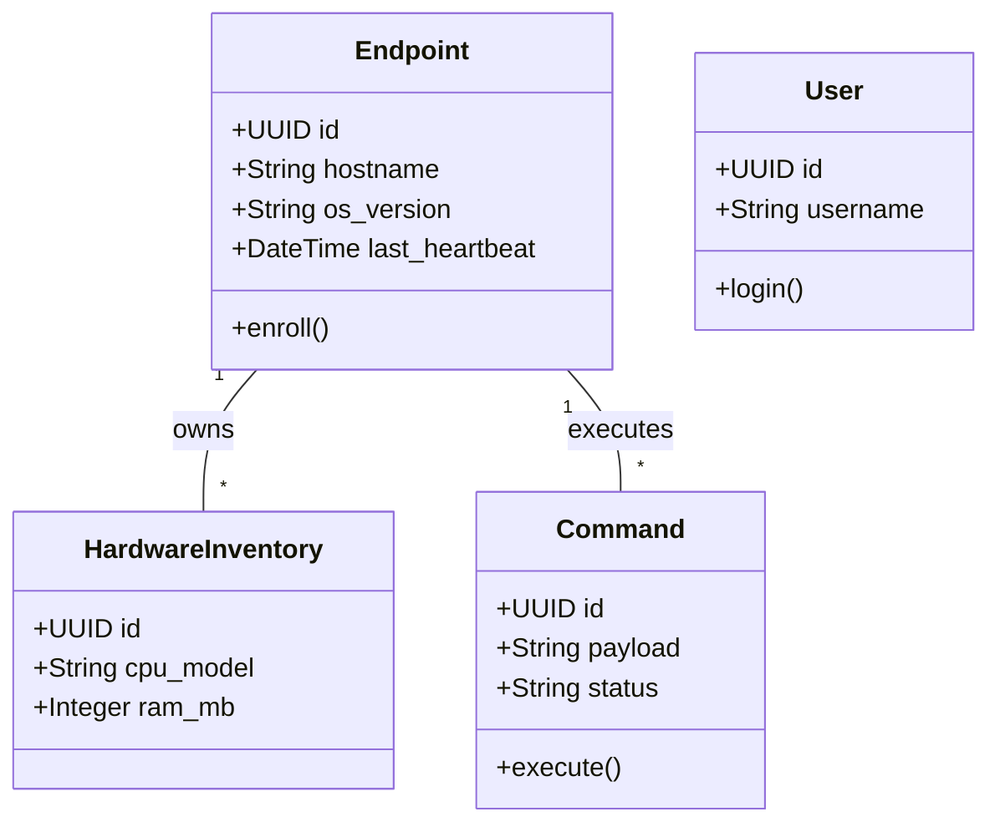
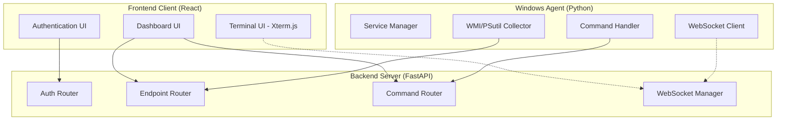
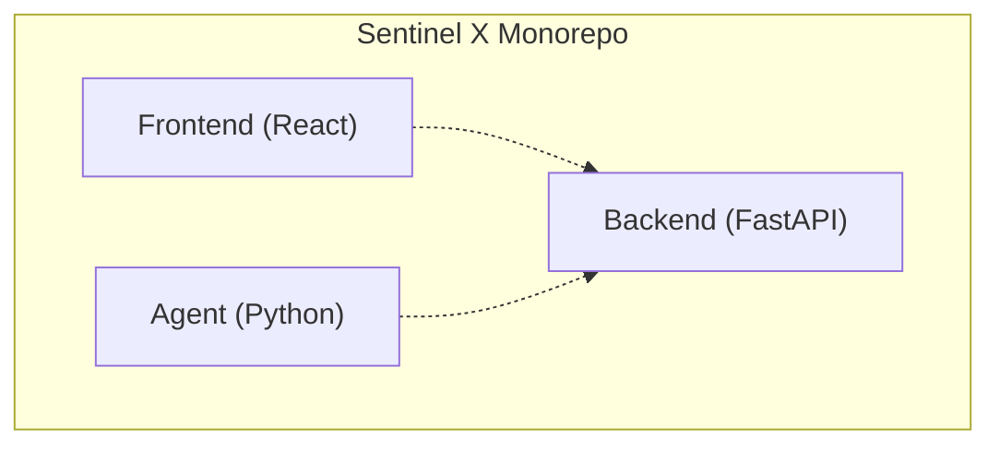
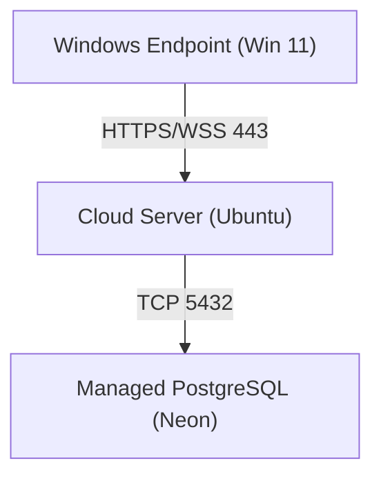
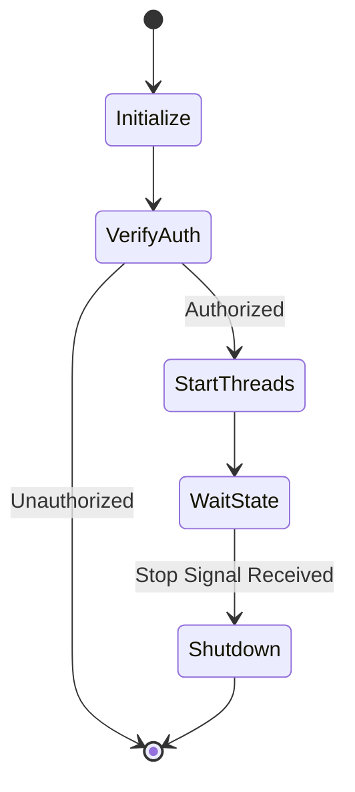
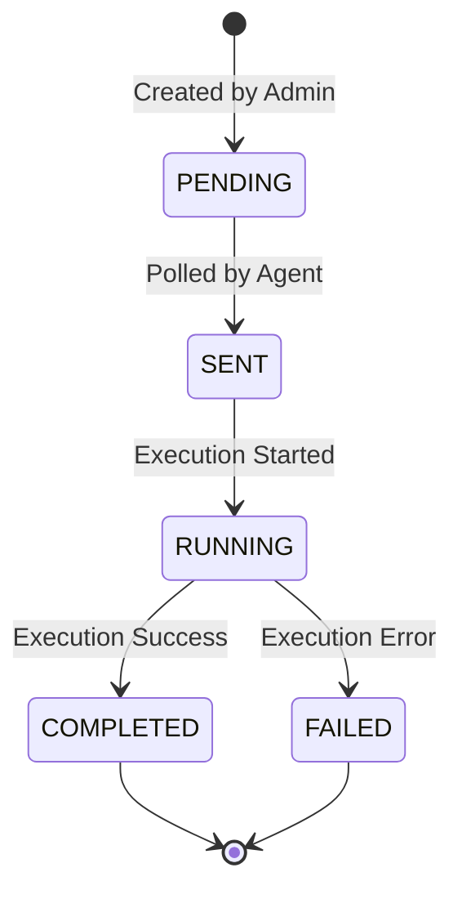
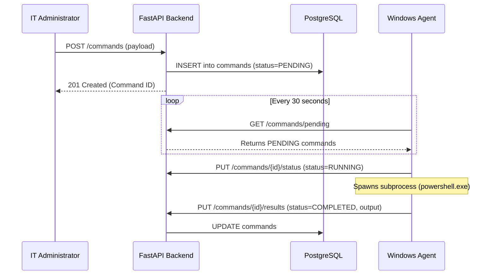
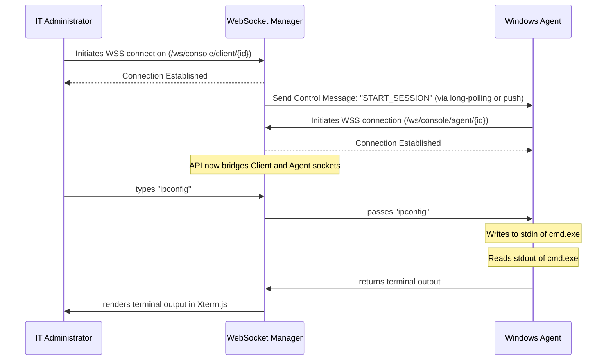
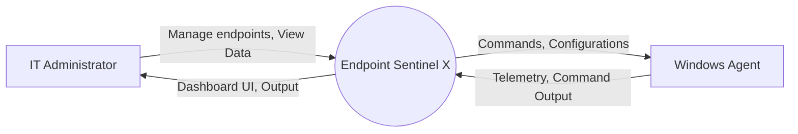
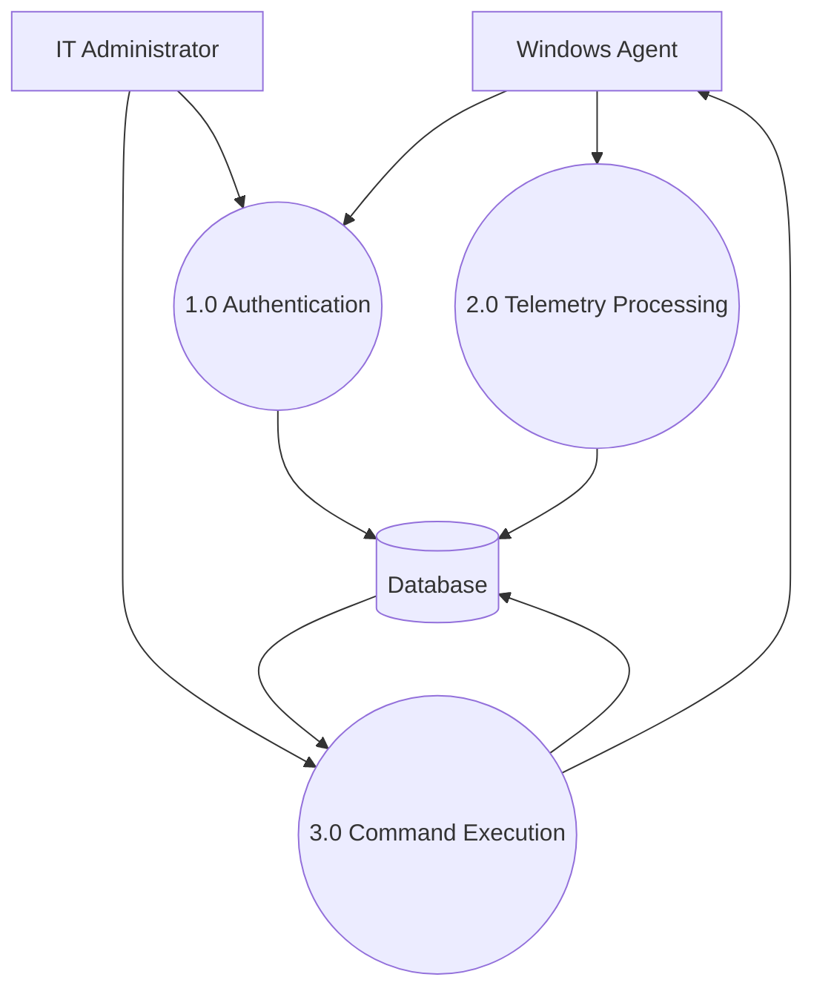

# Chapter 8. UML Modeling

## 8.1 Introduction
Unified Modeling Language (UML) diagrams provide a standardized way to visualize the design of a system. This chapter presents the Use Case, Component, and Sequence diagrams that define the behaviors and structural boundaries of Endpoint Sentinel X, as well as Class, Deployment, and Data Flow diagrams.

## 8.2 Use Case Diagram
The Use Case diagram identifies the primary actors interacting with the system and the distinct operations they can perform.

```mermaid
usecaseDiagram
    actor Admin as "IT Administrator"
    actor Agent as "Windows Agent"
    
    usecase Enroll as "Enroll Endpoint"
    usecase Upload as "Upload Telemetry"
    usecase View as "View Dashboard"
    usecase Dispatch as "Dispatch Command"
    usecase Execute as "Fetch/Execute Command"
    usecase Console as "Open Live Console"

    Admin --> View
    Admin --> Dispatch
    Admin --> Console
    
    Agent --> Enroll
    Agent --> Upload
    Agent --> Execute
    Agent --> Console
```
*Figure 8.1: Use Case Diagram mapping primary actors to system capabilities.*

### 8.2.1 Use Case Descriptions
*   **Enroll Endpoint:** Agent registers itself with the backend using an enrollment token.
*   **Upload Telemetry:** Agent pushes hardware, software, and service data.
*   **View Dashboard:** Administrator logs in and views global metrics.
*   **Dispatch Command:** Administrator queues a PowerShell script for a specific endpoint.
*   **Fetch/Execute Command:** Agent polls for commands, executes them locally, and uploads results.
*   **Open Live Console:** Administrator initiates a WebSocket session. Agent connects and binds its local shell to the WebSocket stream.

## 8.3 Class Diagram
The Class diagram outlines the primary object-oriented models used in the backend ORM layer.


*Figure 8.2: High-Level Class Diagram of Backend Models.*

## 8.4 Component Diagram
The Component diagram illustrates the structural organization of the software modules.


*Figure 8.3: Component Diagram highlighting module separation (To be rendered in Draw.io)*

## 8.5 Package Diagram
The Package diagram depicts the high-level directories and module groupings.


*Figure 8.4: Package Diagram.*

## 8.6 Deployment Diagram
The Deployment diagram shows the physical/logical nodes.


*Figure 8.5: Deployment Diagram.*

## 8.7 Activity Diagram: Service Startup
When the Windows machine boots, the `SentinelAgentService` initiates a specific lifecycle:


*Figure 8.6: Service Startup Activity Diagram.*

## 8.8 State Diagram: Remote Command
Describes the lifecycle of a command entity.


*Figure 8.7: Command State Diagram.*

## 8.9 Sequence Diagrams

### 8.9.1 Remote Command Execution Sequence

*Figure 8.8: Remote Command Execution Sequence Diagram*

### 8.9.2 Live Console WebSocket Sequence

*Figure 8.9: Live Console WebSocket Sequence Diagram*

## 8.10 Data Flow Diagrams (DFD)

### 8.10.1 Level 0 (Context Diagram)

*Figure 8.10: DFD Level 0 Context Diagram.*

### 8.10.2 Level 1 DFD

*Figure 8.11: DFD Level 1 Diagram.*
