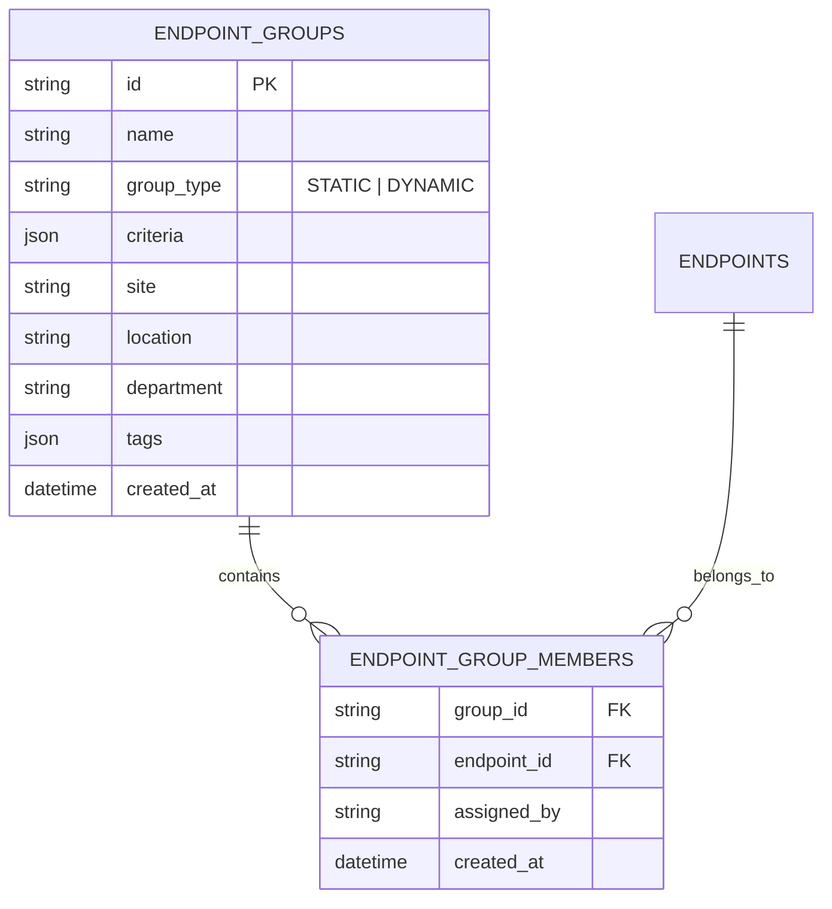
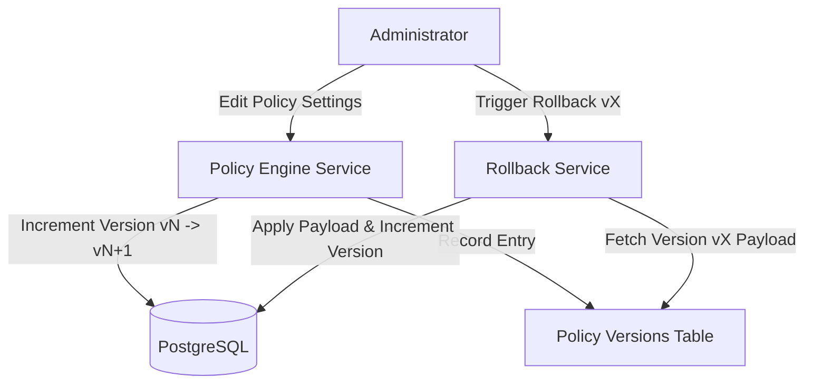
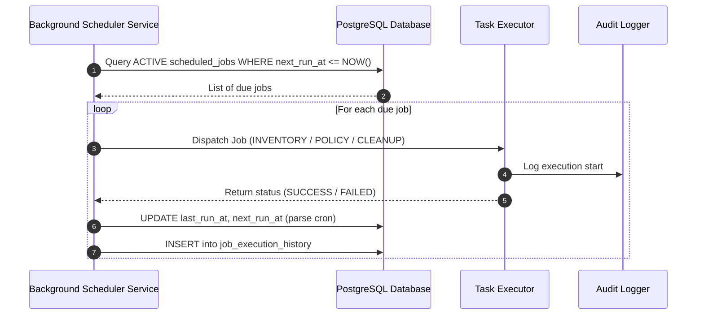

# Enterprise Management Core – Technical Specification & Architecture Manual
## Sentinel X – Enterprise EMM & EDR Platform

---

## 1. Module 1: Endpoint Groups

### Overview
Endpoint Groups permit administrators to categorize endpoints into static collections or dynamic rule-based sets (filtered by Site, Department, Location, Operating System, or Custom Tags).

### Entity-Relationship Diagram (ERD)



### API Reference
- `GET /api/v1/groups` - List all groups with calculated stats (endpoint count, online count, compliance %, health %).
- `POST /api/v1/groups` - Create static or dynamic endpoint group.
- `GET /api/v1/groups/{id}` - Fetch group details.
- `PUT /api/v1/groups/{id}` - Update group settings/criteria.
- `DELETE /api/v1/groups/{id}` - Delete group.
- `GET /api/v1/groups/{id}/endpoints` - List member endpoints.
- `POST /api/v1/groups/{id}/assign` - Assign list of endpoint IDs to group.
- `POST /api/v1/groups/bulk-assign` - Bulk assign endpoint lists across multiple groups.

---

## 2. Module 2: Policy Engine

### Overview
The Policy Engine enforces security configurations across Windows Defender, Windows Firewall, BitLocker Encryption, USB Storage access, Password Rules, Windows Update Patching, RDP, and Power Management.

### Policy Rollback & Versioning Flowchart



### API Reference
- `GET /api/v1/policies` - List policies filtered by category.
- `POST /api/v1/policies` - Create new policy profile.
- `GET /api/v1/policies/{id}` - Fetch policy details & settings payload.
- `PUT /api/v1/policies/{id}` - Update policy and create version history entry.
- `POST /api/v1/policies/{id}/rollback/{version_number}` - Rollback policy to a previous revision.
- `POST /api/v1/policies/{id}/clone` - Clone existing policy into a new profile.
- `POST /api/v1/policies/{id}/assign` - Deploy policy to target endpoints or groups.
- `POST /api/v1/policies/check-conflicts` - Evaluate rule conflict overlaps.

---

## 3. Module 3: Scheduling Engine

### Overview
The Task Scheduling Engine manages recurring and one-time automated jobs including Inventory Data Sync, Security Policy Refresh, Heartbeat Health Checks, Remote Command execution, and System Database Cleanup.

### Sequence Diagram



### API Reference
- `GET /api/v1/schedules` - List all scheduled jobs.
- `POST /api/v1/schedules` - Schedule a new recurring cron or one-time job.
- `GET /api/v1/schedules/{id}` - Get job details.
- `POST /api/v1/schedules/{id}/run-now` - Manually trigger immediate job execution.
- `GET /api/v1/schedules/{id}/history` - Retrieve execution history logs.

---

## 4. Module 4: Notification Center

### Overview
Multi-channel notification framework supporting severity levels (`INFO`, `WARNING`, `ERROR`, `CRITICAL`), real-time WebSocket push updates, and channel abstractions for Email, Webhooks, Slack, and Microsoft Teams.

### Channel Dispatch Architecture

```mermaid
graph LR
    Event[Security Event / System Alert] --> NotifService[Notification Service]
    NotifService --> DB[(Notifications Table)]
    NotifService --> WS[WebSocket Bridge]
    WS font-bold-->>UI[Frontend Toast & Bell UI]
    
    NotifService --> Prefs{User Channel Preferences}
    Prefs -->|Email Enabled| Email[Email Channel Sender]
    Prefs -->|Slack Enabled| Slack[Slack Webhook Sender]
    Prefs -->|Teams Enabled| Teams[Microsoft Teams Adaptive Card Sender]
    Prefs -->|Webhook Enabled| Webhook[HTTP Webhook POST Sender]
```

### API Reference
- `GET /api/v1/notifications` - List user notifications (`unread_only` filter).
- `POST /api/v1/notifications` - Create notification event.
- `PATCH /api/v1/notifications/{id}/read` - Mark notification as read.
- `POST /api/v1/notifications/read-all` - Mark all notifications as read.
- `GET /api/v1/notifications/preferences` - Get notification channel settings.
- `POST /api/v1/notifications/preferences` - Update Email/Slack/Teams channel preferences.

---

## 5. Module 5: Global Search Engine

### Overview
Unified search engine indexing Endpoints, Users, Commands, Alerts, Policies, Audit Logs, and System Documentation accessible via `Ctrl+K` / `Cmd+K` keyboard shortcut.

### API Reference
- `GET /api/v1/search?q={query}` - Multi-entity unified global search.

---

## 6. Developer & Administrator Troubleshooting Guide

### Running Backend API & Services
```bash
# Start FastAPI Server
cd backend
d:\App_New_\Sentinel\.venv\Scripts\python.exe -m uvicorn app.main:app --host 127.0.0.1 --port 8000 --reload
```

### Running Frontend Build
```bash
# Production Vite Build
cd frontend
npm run build
```

### Common Issues
1. **Endpoint Group Statistics Not Updating**: Ensure endpoints belong to `healthy` or `online` status states.
2. **Policy Rollback Error**: Verify `version_number` exists in `policy_versions` table for target policy ID.
