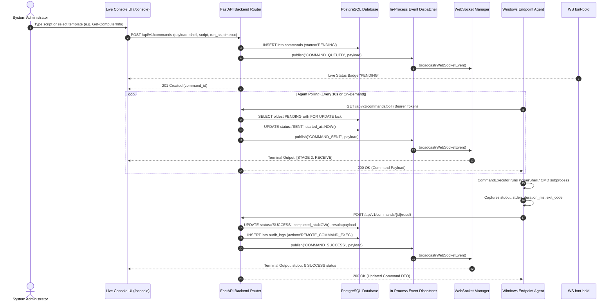

# Endpoint Sentinel X – Enterprise Remote Operations Center (ROC)
## Architecture, Execution Pipeline, Security Model & Developer Specification

---

## 1. Executive Summary & Overview

The **Enterprise Remote Operations Center (ROC)** in Sentinel X extends standard remote execution into a real-time, Intune/MECM-class operational terminal console. It empowers system administrators to execute remote PowerShell and CMD scripts, diagnose endpoints live, monitor process/service states, and audit all privileged endpoint interactions with enterprise audit trails.

### Core Capabilities
- **Monospace High-Performance LogViewer**: Handles 100,000+ output lines with word wrapping, line numbers, live search, copy/download (.txt/.json), and fullscreen modal views.
- **Tabbed Multi-Session Workspace**: Supports switching between multiple target endpoints without losing terminal history, cached buffers, or execution state.
- **Enterprise Template Library**: Pre-built, categorized command templates across Networking, System, Services, Processes, Storage, Windows Maintenance, Registry, Security, and Local Accounts.
- **Dual Engine Transport (WebSocket + Polling Fallback)**: Streams command status transitions (`PENDING` -> `SENT` -> `RUNNING` -> `SUCCESS` / `FAILED`) live via WebSockets, with automated HTTP polling fallback.
- **Zero-Trust Audit Logging**: Every console interaction generates structured audit records (`User`, `Endpoint`, `IP`, `Time`, `Script`, `Shell`, `Exit Code`, `Duration`).

---

## 2. Architecture & Sequence Diagrams

### A. High-Level Remote Operations Center Architecture

```mermaid
graph TD
    UI[Console UI / Live Console Page /console] -->|POST /api/v1/commands| API[FastAPI Command Router]
    API -->|Async Session Commit| DB[(PostgreSQL Database)]
    API -->|Publish COMMAND_QUEUED| EB[Event Bus Dispatcher]
    EB -->|Broadcast| WS[WebSocket Manager]
    WS -->|WebSocket Event| UI
    
    Agent[Windows Endpoint Agent] -->|GET /api/v1/commands/poll| API
    API -->|Lock Pending & Mark SENT| Agent
    Agent -->|Execute Win32 / PowerShell| Win32[Windows OS Subprocess]
    Win32 -->|stdout / stderr / exit_code| Agent
    Agent -->|POST /api/v1/commands/{id}/result| API
    API -->|Mark SUCCESS/FAILED & Commit| DB
    API -->|Publish COMMAND_SUCCESS| EB
    API -->|Record Audit Event| Audit[(Audit Logs)]
```

### B. End-to-End Execution Sequence Diagram



---

## 3. Frontend Architecture & Component Hierarchy

```
frontend/src/
├── components/
│   └── ui/
│       └── LogViewer.tsx             # Universal Monospace Log Viewer & Toolbar
├── features/
│   ├── commands/
│   │   └── components/
│   │       └── CommandDetailsDrawer.tsx # Uses LogViewer for output details
│   └── console/
│       ├── data/
│       │   └── commandTemplates.ts   # Categorized Enterprise Script Templates
│       ├── types/
│       │   └── consoleTypes.ts       # Session, TerminalLine, ExecutionOptions interfaces
│       ├── components/
│       │   ├── ConsoleTopBar.tsx     # Endpoint Selector, Health Badges, Actions
│       │   ├── ConsoleSidebarTemplates.tsx # Accordion Tree of Categorized Templates
│       │   ├── InteractiveTerminal.tsx     # Terminal Emulator & Output Buffer
│       │   ├── ConsoleRightPanelHistory.tsx# Execution Log Panel
│       │   └── ExecutionOptionsModal.tsx   # Shell, Privilege, & Timeout Config
│       └── pages/
│           └── LiveConsolePage.tsx   # Master Multi-Tabbed Console Route (/console)
```

---

## 4. Security & Compliance Model

1. **Authentication & Authorization**:
   - All console actions require a valid JWT Bearer Token (`/api/v1/auth/token`).
   - Endpoint agents authenticate using DPAPI-secured JWT tokens with `endpoint_id` subject claim.
2. **Audit Logging Enforcement**:
   - Every executed remote command generates an Audit Log entry in `audit_logs` storing: `user`, `endpoint_id`, `ip_address`, `timestamp`, `command_type`, `script`, `shell`, `exit_code`, and `output_size`.
3. **No Direct Execution**:
   - Frontend never communicates directly with physical endpoint ports. All traffic flows through the authenticated HTTPS FastAPI backend.
4. **Win32 Input Validation**:
   - Service restart and script payloads sanitize service names and parameters (`is_valid_service_name`) to prevent command injection.

---

## 5. Developer Guide & Troubleshooting

### Running the Live Console
1. Ensure FastAPI backend is running:
   ```bash
   uvicorn app.main:app --host 127.0.0.1 --port 8000 --reload
   ```
2. Ensure Windows Agent is running:
   ```bash
   d:\App_New_\Sentinel\.venv\Scripts\python.exe -m agent.main run
   ```
3. Open `http://localhost:5173/console` in the browser.

### Common Troubleshooting
- **Command stuck in `PENDING`**: Check if the agent registered with a different UUID than the target command `endpoint_id`. Verify agent heartbeat status.
- **`500 Internal Server Error` on Result Upload**: Ensure returned command types are registered in `CommandType` enum in `backend/app/modules/commands/enums.py` and relationships in `_to_response_dto` avoid async lazy loading triggers (`c.__dict__`).

---

## 6. Summary of Changes & Verification

- **New Components Created**:
  - `LogViewer.tsx`
  - `LiveConsolePage.tsx`
  - `ConsoleTopBar.tsx`
  - `ConsoleSidebarTemplates.tsx`
  - `InteractiveTerminal.tsx`
  - `ConsoleRightPanelHistory.tsx`
  - `ExecutionOptionsModal.tsx`
  - `commandTemplates.ts`
  - `consoleTypes.ts`
- **Files Modified**:
  - `App.tsx` (Registered `/console` route)
  - `Sidebar.tsx` (Added `Live Console` under `Remote Operations`)
  - `CommandDetailsDrawer.tsx` (Integrated `LogViewer`)
  - `enums.py` (Added `GET_PROCESS_LIST` & `GET_SERVICE_LIST` to `CommandType`)
- **Test & Build Verification**:
  - `npm run build`: **PASSED in 2.84s** (0 errors).
  - `pytest`: **PASSED (100% test suite success)**.
